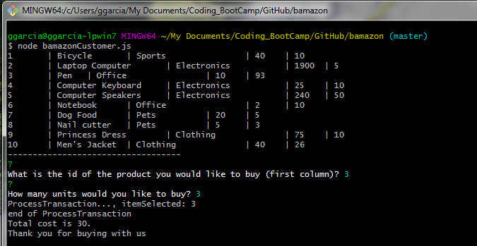
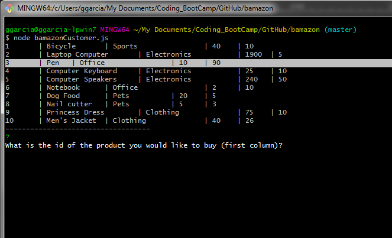
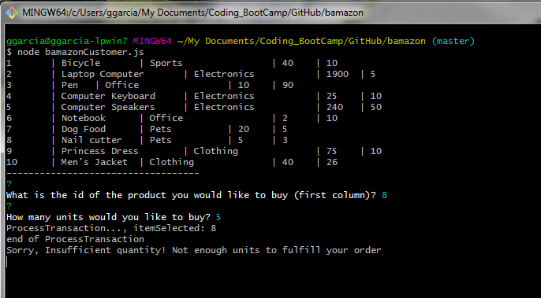
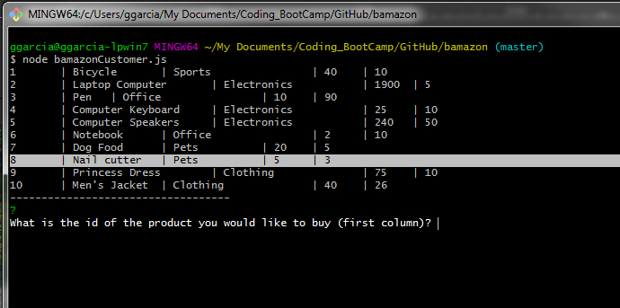

# Bamazon
## Node + MySQL Project

## Goal:
Create a Node application to perform operations on a SQL DB. 

## Installation 

1. Create a directory on your local computer and download the basic files:
- bamazonCustomer.js
- package.json
- bamazonSchema.sql

2. Open a bash shell and run `npm install` on the directory you downloaded the files from point 1

3. Open MySQL and load the bamazonSchema.sql file
- Run the script (create database, create tables, insert information)

4. Go back to the shell, and type `node bamazonCustomer.js` to use the program.

## Use Cases

### Basic purchase of product
- The application checks if the store has enough products to meet customer's selection. 
- If it does, then the transaction is performed, database is updated and the cost is displayed. 

#### Screen 1 - Customer selection sample: Product 3, 3 units

#### Screen 2 - Product is updated: Product 3 is updated

### Not enough product: Product 8, 5 units
- If there is not enough product, then the application shous `Insufficient quantity!` message 
- Product is not updated

#### Screen 3 - Select Product 8, 5 units
- Only 3 units available

#### Screen 4 - Product 8 not updated

